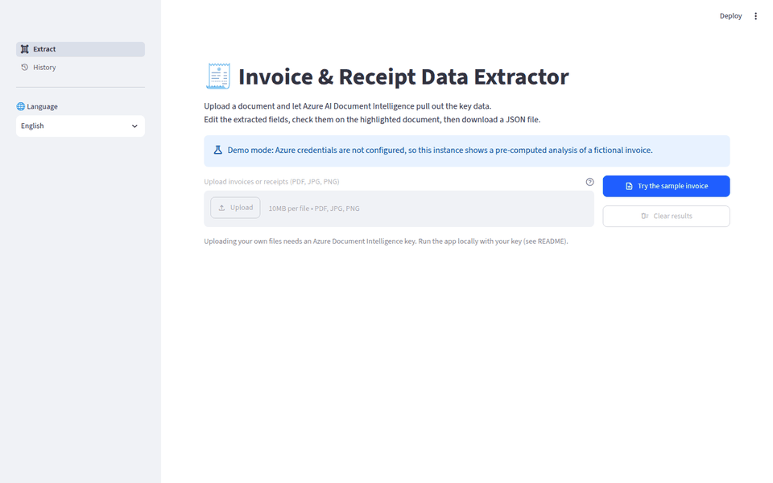
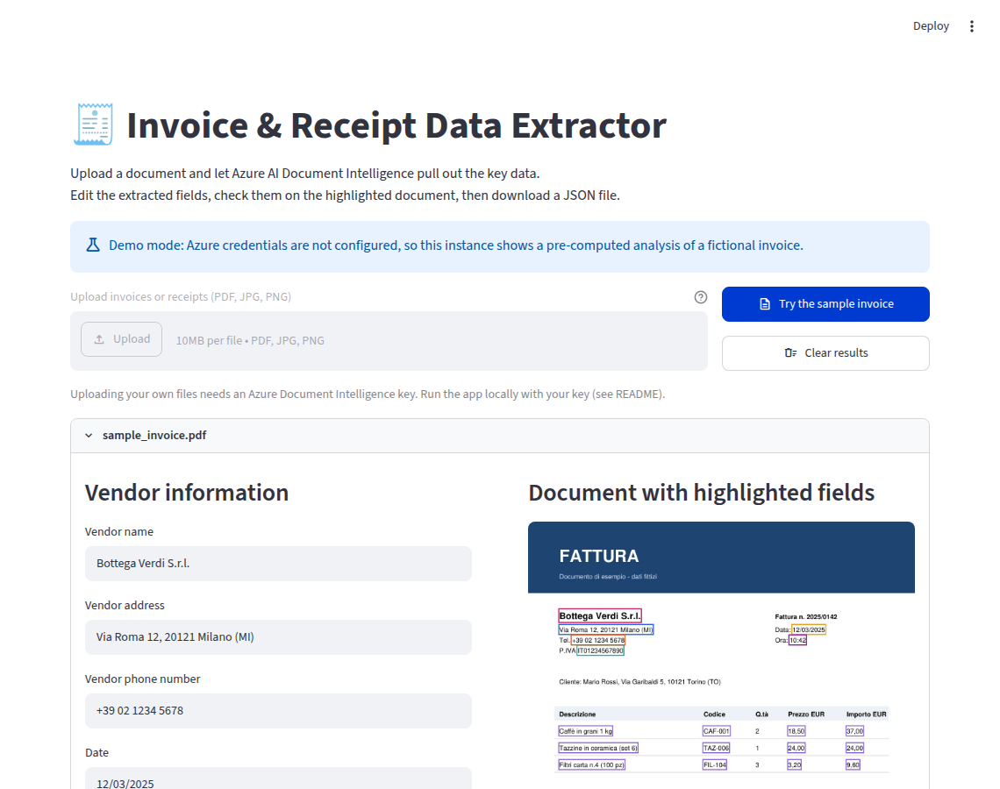
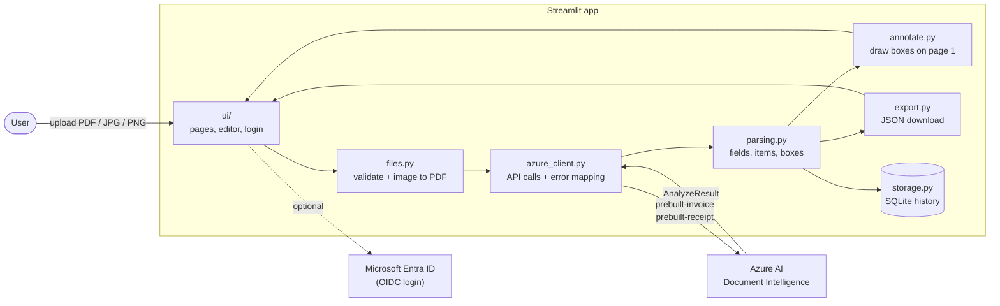

# Invoice & Receipt Data Extractor

[](https://github.com/emamira02/Extract_invoices/actions/workflows/tests.yml)


A Streamlit web app that reads invoices and receipts with **Azure AI Document Intelligence**.
You upload a PDF or a photo, the app extracts vendor, date, VAT number, total and line items,
highlights where each value was found on the document, and lets you correct the data and export it as JSON.

**Live demo:** _add your Streamlit Community Cloud link here_ (runs in demo mode, see below)



## Features

- **Upload** PDF, JPG or PNG files (several at once). Images are converted to PDF before analysis.
- **Extraction** with two prebuilt Azure models: `prebuilt-invoice` for the invoice fields and line items,
  and `prebuilt-receipt` for the phone number and transaction time, which the invoice model does not return.
- **Visual check:** the fields are drawn as colored boxes on the first page of the document.
- **Editing:** every field and line item can be corrected before export, plus an optional expense category.
- **JSON export** with keys in the selected language.
- **History:** the last 10 analyses per user are saved in SQLite and can be searched, reopened and cleared.
- **Microsoft Entra ID login** (optional) through Streamlit's built-in `st.login()`, with an optional email allow-list.
- **UI in English, Italian and Spanish.**
- **Demo mode:** without Azure credentials the app still runs and shows a bundled sample, so anyone can try it for free.



## Architecture



The code is split so that everything in `invoice_extractor/` is plain Python with **no Streamlit import**.
That keeps the logic unit-testable, and the UI layer only wires widgets to these functions.

```
app.py                     entry point: page config, language, login, navigation
ui/
  common.py                settings, login gate, result editor (fields, items, preview, download)
  extract_page.py          upload and analysis page
  history_page.py          history page
invoice_extractor/
  config.py                settings from environment variables / .env
  files.py                 upload validation, image to PDF conversion
  azure_client.py          Document Intelligence calls, readable error messages
  parsing.py               raw result to fields, line items and bounding boxes
  annotate.py              renders page 1 and draws the boxes
  export.py                JSON export with translated keys
  storage.py               SQLite history (per user, last N entries)
  pipeline.py              validate -> analyse -> parse, and the demo sample loader
  i18n.py                  UI strings (EN / IT / ES)
sample_data/               fictional sample invoice + pre-computed result for demo mode
scripts/                   sample generator and a helper to record real Azure responses
tests/                     pytest suite
```

## Run it locally

Requires Python 3.11 or newer.

```bash
git clone https://github.com/emamira02/Extract_invoices.git
cd Extract_invoices
python -m venv .venv && source .venv/bin/activate    # Windows: .venv\Scripts\activate
pip install -r requirements.txt
streamlit run app.py
```

Open http://localhost:8501. With no configuration the app starts in **demo mode**:
click *Try the sample invoice* to see a full result.

### Use your own Azure resource

1. In the Azure portal, create a **Document Intelligence** resource (the free F0 tier is enough to try it).
2. Copy `.env.example` to `.env` and fill in the two values from *Keys and Endpoint*:

   ```ini
   AZURE_DOCINTEL_ENDPOINT=https://<your-resource>.cognitiveservices.azure.com/
   AZURE_DOCINTEL_KEY=<your key>
   ```
3. Restart the app. Uploading is now enabled.

Keys are only read from the environment. `.env` and `.streamlit/secrets.toml` are git-ignored.

### Enable Microsoft login (optional)

1. Register an app in **Microsoft Entra ID** and add the redirect URI `http://localhost:8501/oauth2callback`.
2. Copy `.streamlit/secrets.toml.example` to `.streamlit/secrets.toml` and fill in the client ID, secret and tenant.
3. Optionally set `ALLOWED_EMAILS` in `.env` to restrict access.

Without an `[auth]` section the app runs without login.

### Docker

```bash
cp .env.example .env        # add your Azure values, or leave empty for demo mode
docker compose up --build
```

## Tests

```bash
pip install -r requirements-dev.txt
pytest
```

The tests cover number parsing in Italian and English formats, parsing a full invoice + receipt result,
file validation (wrong type, empty, corrupted, too large, image to PDF) and the history store.
They use JSON fixtures, so they need no Azure key. GitHub Actions runs them on every push.

## Deploy on Streamlit Community Cloud

1. Push the repository to GitHub.
2. On [share.streamlit.io](https://share.streamlit.io) choose **Create app**, pick this repo and branch, and set the main file to `app.py`.
3. Deploy. With no secrets the app runs in demo mode, which is safe to share publicly.
4. To enable real uploads, open **Settings > Secrets** and add:

   ```toml
   AZURE_DOCINTEL_ENDPOINT = "https://<your-resource>.cognitiveservices.azure.com/"
   AZURE_DOCINTEL_KEY = "<your key>"
   ```

   If you do this on a public app, also enable Microsoft login (add the `[auth]` block with the
   redirect URI `https://<your-app>.streamlit.app/oauth2callback`) so strangers cannot spend your Azure quota.

## Notes and limitations

- Bounding boxes are drawn on the first page only; all pages are sent to Azure.
- The demo result in `sample_data/` is **not** real Azure output: it is generated by
  `scripts/make_sample_invoice.py` in the same format, for a fictional company.
  `scripts/record_analysis.py` can replace it with a real response from your resource.
- On Streamlit Community Cloud the SQLite history is reset whenever the app restarts.
